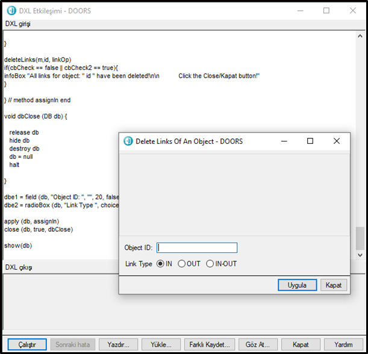
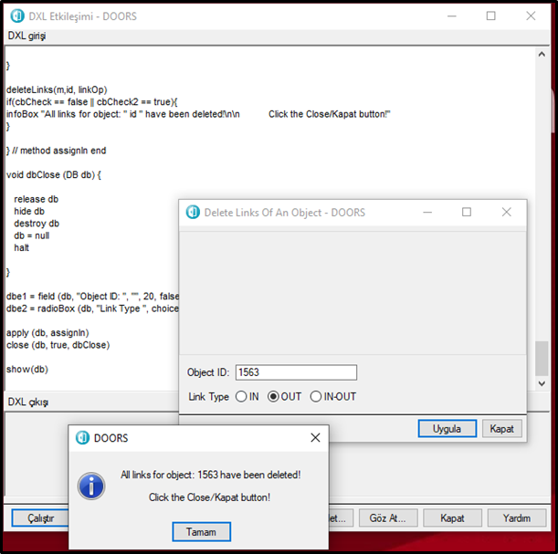
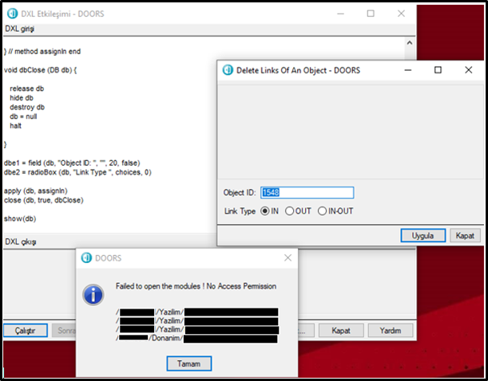

# IBM DOORS DXL Script – Delete Links of an Object

This project is a **DXL script** designed in **IBM DOORS** for **managing and deleting links** between DOORS objects. It offers a flexible and recursive way to delete incoming, outgoing, or both types of links, while considering parent-child relationships and user permissions.

---

## Technologies Used

- **DXL (DOORS Extension Language)** – Scripting language specific to IBM DOORS
- **IBM DOORS** – Requirements management tool

---

## Features

- Supports deleting:
  - Only **incoming** links
  - Only **outgoing** links
  - **Both** incoming and outgoing links
- Handles **hierarchical structures**:
  - If the object has children, their links are deleted **recursively**
  - Supports 3 levels tested (`parent → child → grandchild`)
- Includes **access checks**:
  - If the user lacks permission to access certain modules, those links are **not deleted**
  - A warning is shown with the list of inaccessible modules

---

## How It Works

### Interface Workflow

1. When the script is run, a dialog box opens.
2. You enter:
   - **Object ID** (Absolute Number)
   - **Link Type**:
     - `"IN"` – Incoming links only
     - `"OUT"` – Outgoing links only
     - `"IN-OUT"` – Both directions
3. Click the **Apply** button to perform deletion.
4. Once the operation completes, click **Close (Kapat)** to exit the interface.

---

## Deletion Logic Overview

- Finds the object by ID in the current module.
- Checks link type and link direction.
- Handles:
  - Orphan nodes
  - Direct and nested children
  - Permission issues with linked modules
- Uses recursive deletion for all child levels (tested up to level 3).

### Link Structure Example
<pre>
parent
└── child
└── grandchild
└── great-grandchild (Level 4 not tested)
</pre>

---

## ⚠️ Notes

- If you do **not have access** to a module that contains linked objects:
  - The links in that module **will not be deleted**
  - You’ll get a message listing the inaccessible modules
- Level 4 nested children (`parent → child → child → child`) **have not been tested**
- Make sure the module is **in edit mode** before running the script
- If code does not work, try lazy version !!!

---

## Example Usage

1. Open your module in DOORS
2. Paste and run the script in the DXL editor
3. Enter Object ID: `12345`
4. Choose Link Type: `IN-OUT`
5. Click Apply → Links will be deleted recursively
6. Click Close to exit

---

## Overview
 
<table>
  <tr>
     <td></td>
  </tr>
  <tr>
      <td></td>
  </tr>
  <tr>
    <td></td>
  </tr>
</table>  

